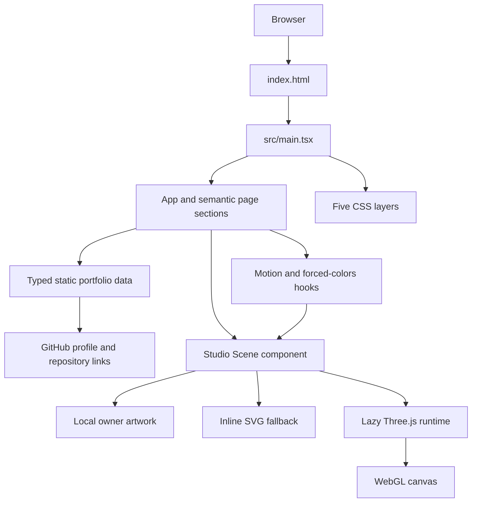

# System Architecture

## Overview

The portfolio is a client-side React application. Vite supplies the development/build toolchain; the page renders static typed content, standard HTML controls, local visual assets, CSS, and an optional isolated Three.js depth layer. It does not include an application backend.

## Rendering path

1. `index.html` supplies document metadata and the `#root` mount point.
2. `src/main.tsx` mounts `App` in React `StrictMode` and imports base, layout, component, studio-scene, and content-section styles.
3. `App` composes the page shell and shares its motion-preference result with the header control and hero visual.
4. `StudioScene` always renders the local owner artwork and a decorative inline SVG. When allowed, it also creates the optional canvas host.
5. Sections read static records from `src/content/portfolio-data.ts`; GitHub is reached through normal external anchors.

## Preference and fallback path

`useMediaQuery` reads browser media queries with safe no-match behavior when `matchMedia` is unavailable and supports both modern and legacy media-query listeners. `useMotionPreference` combines `prefers-reduced-motion` with an optional local-storage setting. System reduction takes precedence and disables the local control. `useForcedColors` watches `(forced-colors: active)` through the same adapter.

`StudioScene` renders a local 3D portrait illustration, an inline SVG fallback, and an empty visual host. If either reduced motion or forced colors is active, no WebGL runtime starts. Forced-colors also hides the decorative portrait so the inline SVG uses system colors. Otherwise, an intersection observer and an idle-time task can initiate a dynamic import of the Three.js runtime. All visual-only layers are hidden from assistive technology.

## Three.js lifecycle

The runtime creates procedural primitive geometry, materials, lights, and a renderer only after the optional enhancement starts. It caps pixel ratio and uses a smaller composition below the mobile breakpoint. On fine-pointer devices, the decorative icons use a gentle 14fps timer-plus-render-frame cadence only while the scene is in view and the document is visible; coarse pointers stay static. Reduced-motion and forced-colors modes never start the runtime.

The scene is intentionally original: it uses procedural systems-console primitives and a project-owned portrait artwork rather than external 3D models. It does not load remote media or send the portrait to the browser at runtime.

On normal component cleanup it cancels scheduled frames, disconnects observers, removes event listeners, disposes geometries/materials, disposes and loses the renderer context, and removes the canvas. If setup throws, the same helper path disposes completed resources and the renderer before the error propagates to the component-level fallback path. If an already-running canvas emits `webglcontextlost`, the component uses the same cleanup path and returns to the static path.

## Data and trust boundaries

| Boundary | Behavior |
| --- | --- |
| Portfolio data | Local typed constants; no network fetch or user input. |
| Owner artwork | Project-local static image; no runtime third-party asset request. |
| Browser preferences | Read from media queries; the optional local motion choice uses browser local storage. |
| External links | GitHub URLs are authored static content and open with `rel="noreferrer"`. |
| Backend/data storage | No backend, API client, authentication flow, or application database source is present. |

## References

- [Project overview and product requirements](./project-overview-pdr.md)
- [Codebase summary](./codebase-summary.md)
- [Code standards](./code-standards.md)
