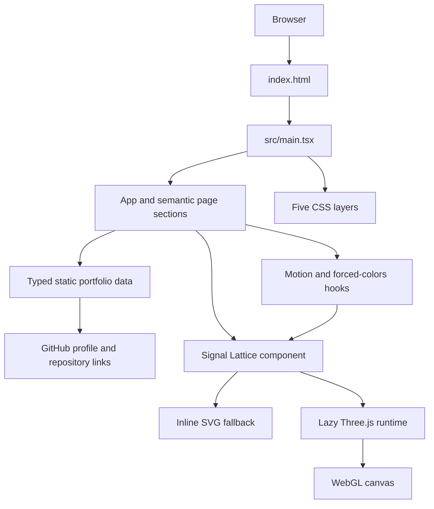

# System Architecture

## Overview

The portfolio is a client-side React application. Vite supplies the development/build toolchain; the page itself renders static typed content, standard HTML controls, CSS, and an optional isolated Three.js visual. It does not include an application backend.

## Rendering path

1. `index.html` supplies document metadata and the `#root` mount point.
2. `src/main.tsx` mounts `App` in React `StrictMode` and imports base, layout, component, Signal Lattice, and content-section styles.
3. `App` composes the page shell and shares its motion-preference result with the header control and hero visual.
4. Sections read static records from `src/content/portfolio-data.ts`; GitHub is reached through normal external anchors.

## Preference and fallback path

`useMediaQuery` reads browser media queries with safe no-match behavior when `matchMedia` is unavailable and supports both modern and legacy media-query listeners. `useMotionPreference` combines `prefers-reduced-motion` with an optional local-storage setting. System reduction takes precedence and disables the local control. `useForcedColors` watches `(forced-colors: active)` through the same adapter.

The Signal Lattice always renders an inline SVG fallback plus an empty visual host. If either reduced motion or forced colors is active, no WebGL runtime starts. Otherwise, an intersection observer and an idle-time task can initiate a dynamic import of the Three.js runtime. The visual remains decorative: its SVG, host, and canvas are hidden from assistive technology.

## Three.js lifecycle

The runtime creates primitive geometry, materials, lights, and a renderer only after the optional enhancement starts. It caps pixel ratio, uses fewer nodes below the mobile breakpoint, avoids a continuous animation loop, and reacts to resize, visibility, intersection, and fine-pointer input.

On normal component cleanup it cancels scheduled frames, disconnects observers, removes event listeners, disposes geometries/materials, disposes and loses the renderer context, and removes the canvas. If setup throws, the same helper path disposes completed resources and the renderer before the error propagates to the component-level fallback path. If an already-running canvas emits `webglcontextlost`, the component uses the same cleanup path and returns to the visible SVG fallback.

## Data and trust boundaries

| Boundary | Behavior |
| --- | --- |
| Portfolio data | Local typed constants; no network fetch or user input. |
| Browser preferences | Read from media queries; the optional local motion choice uses browser local storage. |
| External links | GitHub URLs are authored static content and open with `rel="noreferrer"`. |
| Backend/data storage | No backend, API client, authentication flow, or application database source is present. |

## References

- [Project overview and product requirements](./project-overview-pdr.md)
- [Codebase summary](./codebase-summary.md)
- [Code standards](./code-standards.md)
